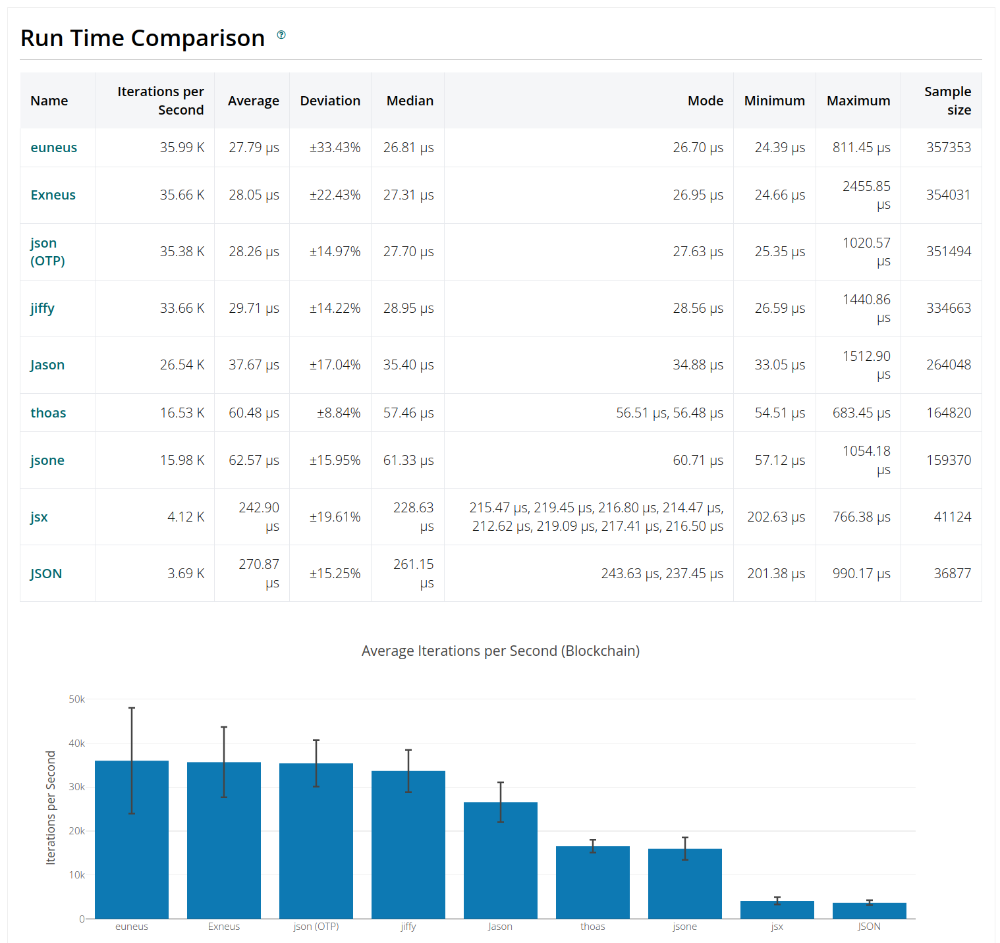
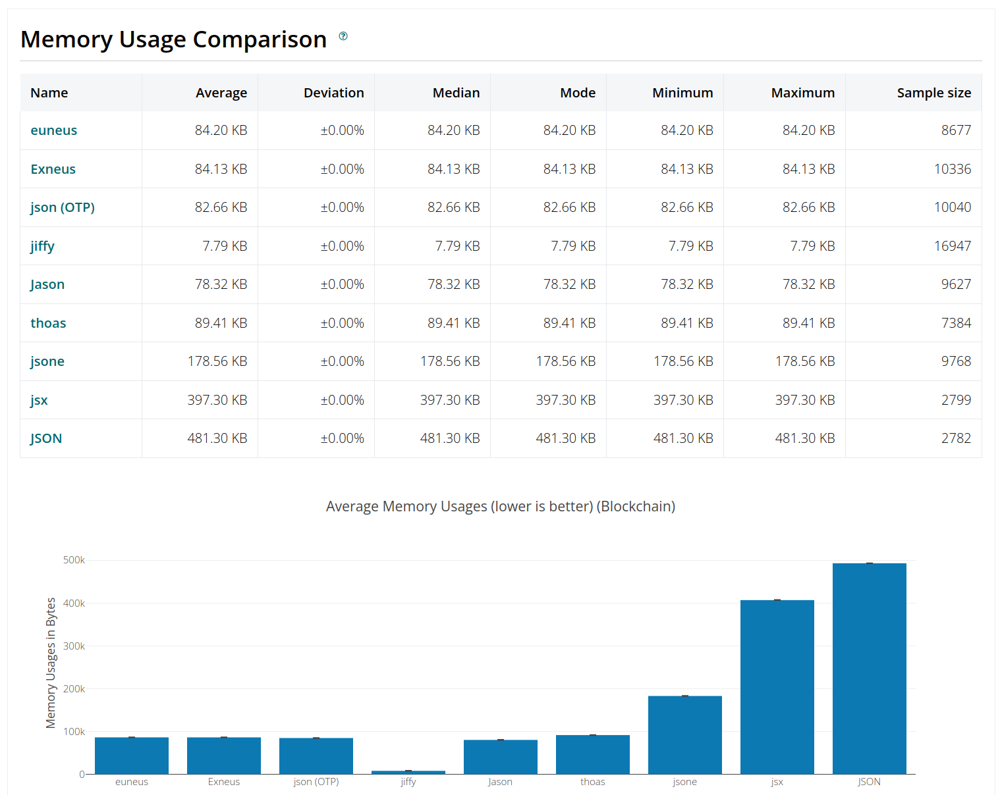
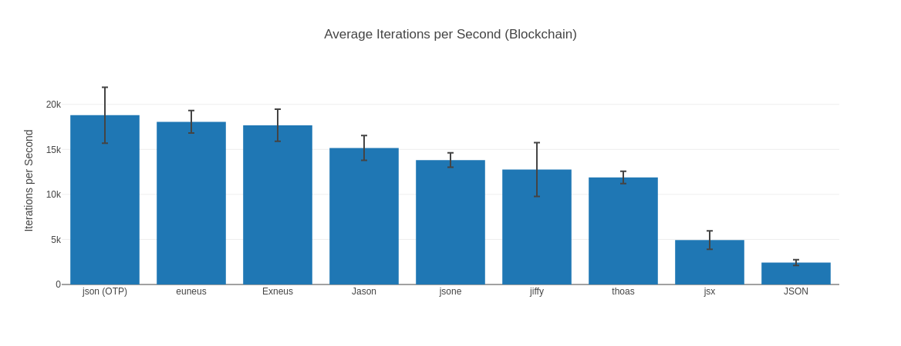
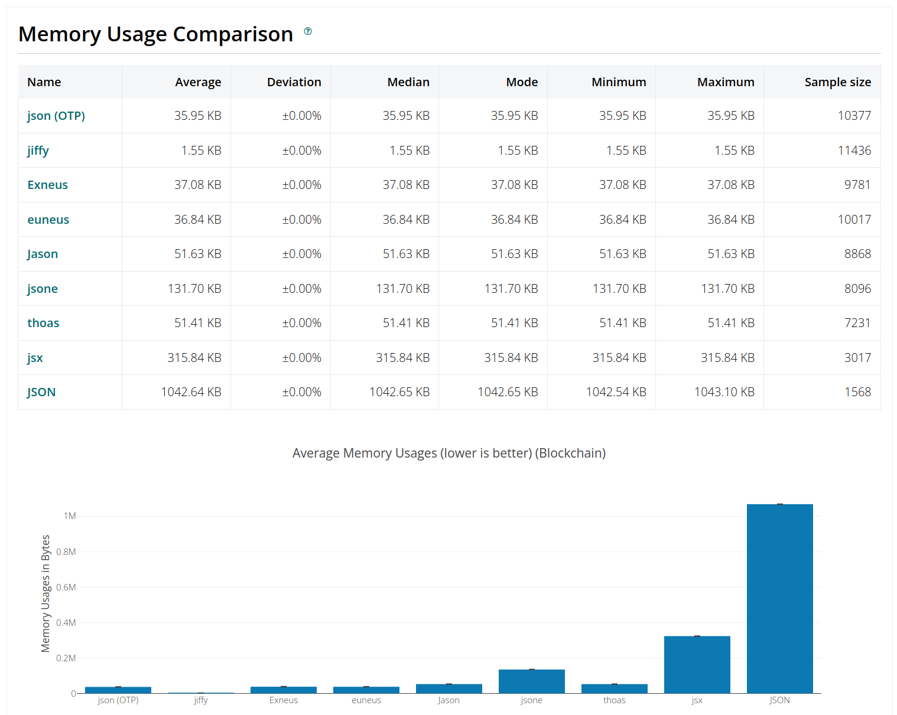

# Exneus

[](https://github.com/williamthome/exneus/actions)
[](https://github.com/williamthome/exneus/actions/workflows/ci.yml)
[](https://elixir-lang.org/)
[](http://www.erlang.org)
[](https://github.com/williamthome/exneus/releases/latest)
[](https://hex.pm/packages/exneus)
[](https://hexdocs.pm/exneus/)
[](https://hex.pm/packages/exneus)
[](https://github.com/williamthome/exneus/blob/main/LICENSE)
[](https://github.com/williamthome/exneus/commits/main)

An incredibly flexible and performant JSON parser, generator and formatter for Elixir.

Exneus is a wrapper for Elixir of [Euneus](https://github.com/williamthome/euneus),
an Erlang library built on the top of the new [OTP json module](https://erlang.org/documentation/doc-15.0-rc3/lib/stdlib-6.0/doc/html/json.html).

Both encoder and decoder fully conform to [RFC 8259](https://datatracker.ietf.org/doc/html/rfc8259)
and [ECMA 404](https://ecma-international.org/publications-and-standards/standards/ecma-404/) standards
and are tested using [JSONTestSuite](https://github.com/nst/JSONTestSuite).

Further explanation and examples are available at [hexdocs](https://hexdocs.pm/exneus).

## Installation

```elixir
def deps do
  [
    {:json_polyfill, "~> 0.1"}, # Required only for OTP < 27
    {:exneus, "~> 0.1"}
  ]
end
```

## Basic usage

```elixir
iex(1)> Exneus.encode!(%{name: "Joe Armstrong", age: 68, nationality: "British"})
"{\"name\":\"Joe Armstrong\",\"age\":68,\"nationality\":\"British\"}"
iex(2)> Exneus.decode!(v(1))
%{"age" => 68, "name" => "Joe Armstrong", "nationality" => "British"}
```

## Encode

Functions that provide JSON encoding:

- `Exneus.encode!/2`
- `Exneus.encode_to_iodata!/2`

## Decode

Functions that provide JSON decoding:

- `Exneus.decode!/2`

## Stream

Functions that provide JSON decode streaming:

- `Exneus.decode_stream_start!/2`
- `Exneus.decode_stream_continue!/2`
- `Exneus.decode_stream_end!/1`

## Format

Functions that provide JSON formatting:

- `Exneus.minify/1`
- `Exneus.minify_to_iodata/1`
- `Exneus.format/2`
- `Exneus.format_to_iodata/2`

## Benchmark

> - Operating System: Linux
> - CPU Information: 12th Gen Intel(R) Core(TM) i9-12900HX
> - Number of Available Cores: 24
> - Available memory: 31.09 GB
> - Elixir 1.17.2
> - Erlang 27.0.1
> - JIT enabled: true
>
> Benchmark suite executing with the following configuration:
>
> - warmup: 1 s
> - time: 10 s
> - memory time: 1 s
> - reduction time: 0 ns
> - parallel: 1
> - inputs: Blockchain

### Encode

Encode run time comparison:



Encode memory usage comparison:



### Decode

Decode run time comparison:



Decode memory usage comparison:



## Sponsors

If you like this tool, please consider [sponsoring me](https://github.com/sponsors/williamthome).
I'm thankful for your never-ending support :heart:

I also accept coffees :coffee:

[](https://www.buymeacoffee.com/williamthome)

## License

Copyright (c) 2024 [William Fank Thomé](https://github.com/williamthome)

Exneus is 100% open-source and community-driven. All components are
available under the Apache 2 License on [GitHub](https://github.com/williamthome/exneus).

See [LICENSE.md](LICENSE.md) for more information.
