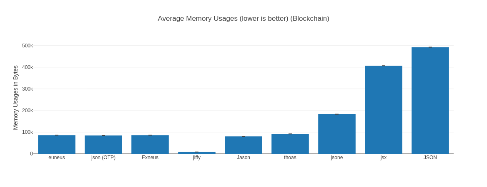

# Exneus Benchmark

> - Operating System: Linux
> - CPU Information: 12th Gen Intel(R) Core(TM) i9-12900HX
> - Number of Available Cores: 24
> - Available memory: 31.09 GB
> - Elixir 1.17.2
> - Erlang 27.0.1
> - JIT enabled: true
>
> Benchmark suite executing with the following configuration:
>
> - warmup: 1 s
> - time: 10 s
> - memory time: 1 s
> - reduction time: 0 ns
> - parallel: 1
> - inputs: Blockchain

## Encode

Encode run time comparison:

```console
##### With input Blockchain #####
Name                 ips        average  deviation         median         99th %
euneus           36.95 K       27.06 μs    ±34.15%       26.10 μs       34.76 μs
json (OTP)       35.85 K       27.90 μs    ±14.90%       27.22 μs       35.61 μs
Exneus           35.71 K       28.00 μs    ±10.67%       27.18 μs       35.77 μs
jiffy            34.70 K       28.82 μs    ±15.29%       28.14 μs       37.15 μs
Jason            26.75 K       37.38 μs    ±16.27%       35.48 μs       48.25 μs
thoas            16.40 K       60.99 μs     ±9.55%       57.84 μs       72.94 μs
jsone            15.52 K       64.44 μs    ±15.47%       63.12 μs       93.81 μs
jsx               4.21 K      237.35 μs    ±17.87%      225.05 μs      461.23 μs
JSON              3.88 K      257.54 μs    ±13.80%      248.47 μs      403.79 μs

Comparison:
euneus           36.95 K
json (OTP)       35.85 K - 1.03x slower +0.83 μs
Exneus           35.71 K - 1.03x slower +0.94 μs
jiffy            34.70 K - 1.06x slower +1.76 μs
Jason            26.75 K - 1.38x slower +10.32 μs
thoas            16.40 K - 2.25x slower +33.92 μs
jsone            15.52 K - 2.38x slower +37.38 μs
jsx               4.21 K - 8.77x slower +210.29 μs
JSON              3.88 K - 9.52x slower +230.47 μs
```


Encode memory usage comparison:

```console
##### With input Blockchain #####
Name          Memory usage
euneus            84.20 KB
json (OTP)        82.66 KB - 0.98x memory usage -1.53125 KB
Exneus            84.13 KB - 1.00x memory usage -0.06250 KB
jiffy              7.79 KB - 0.09x memory usage -76.40625 KB
Jason             78.32 KB - 0.93x memory usage -5.87500 KB
thoas             89.41 KB - 1.06x memory usage +5.22 KB
jsone            178.56 KB - 2.12x memory usage +94.37 KB
jsx              397.30 KB - 4.72x memory usage +313.11 KB
JSON             481.30 KB - 5.72x memory usage +397.11 KB
```



## Decode

Decode run time comparison:

```console
##### With input Blockchain #####
Name                 ips        average  deviation         median         99th %
json (OTP)       18.79 K       53.21 μs    ±16.52%       51.72 μs       61.94 μs
euneus           18.06 K       55.37 μs     ±6.91%       54.64 μs       63.03 μs
Exneus           17.68 K       56.55 μs    ±10.11%       55.98 μs       65.02 μs
Jason            15.16 K       65.95 μs     ±9.13%       65.09 μs       82.98 μs
jsone            13.82 K       72.38 μs     ±5.79%       72.07 μs       83.88 μs
jiffy            12.76 K       78.36 μs    ±23.38%       68.45 μs      145.49 μs
thoas            11.89 K       84.10 μs     ±5.79%       83.40 μs       96.02 μs
jsx               4.93 K      202.84 μs    ±20.64%      189.98 μs      379.74 μs
JSON              2.43 K      411.69 μs    ±13.42%      401.45 μs      699.87 μs

Comparison:
json (OTP)       18.79 K
euneus           18.06 K - 1.04x slower +2.16 μs
Exneus           17.68 K - 1.06x slower +3.34 μs
Jason            15.16 K - 1.24x slower +12.74 μs
jsone            13.82 K - 1.36x slower +19.17 μs
jiffy            12.76 K - 1.47x slower +25.15 μs
thoas            11.89 K - 1.58x slower +30.89 μs
jsx               4.93 K - 3.81x slower +149.64 μs
JSON              2.43 K - 7.74x slower +358.48 μs
```


Decode memory usage comparison:

```console
##### With input Blockchain #####
Name               average  deviation         median         99th %
json (OTP)        35.95 KB     ±0.00%       35.95 KB       35.95 KB
euneus            36.93 KB     ±0.00%       36.93 KB       36.93 KB
Exneus            37.05 KB     ±0.00%       37.05 KB       37.05 KB
Jason             51.63 KB     ±0.00%       51.63 KB       51.63 KB
jsone            131.70 KB     ±0.00%      131.70 KB      131.70 KB
jiffy              1.55 KB     ±0.00%        1.55 KB        1.55 KB
thoas             51.41 KB     ±0.00%       51.41 KB       51.41 KB
jsx              315.84 KB     ±0.00%      315.84 KB      315.84 KB
JSON            1042.65 KB     ±0.00%     1042.65 KB     1042.65 KB

Comparison:
json (OTP)        35.95 KB
euneus            36.93 KB - 1.03x memory usage +0.98 KB
Exneus            37.05 KB - 1.03x memory usage +1.09 KB
Jason             51.63 KB - 1.44x memory usage +15.67 KB
jsone            131.70 KB - 3.66x memory usage +95.74 KB
jiffy              1.55 KB - 0.04x memory usage -34.40625 KB
thoas             51.41 KB - 1.43x memory usage +15.46 KB
jsx              315.84 KB - 8.78x memory usage +279.89 KB
JSON            1042.65 KB - 29.00x memory usage +1006.69 KB
```


